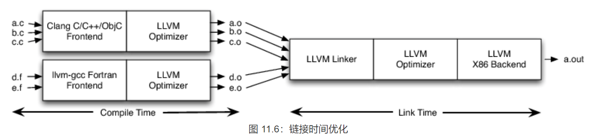

#### 1. The Architecture of Open Source Applications

本章讨论了一些塑造 LLVM 的设计决策[，](http://www.aosabook.org/en/llvm.html#footnote-1) LLVM 是一个伞式项目，托管和开发一组紧密结合的低级工具链组件（例如，汇编器、编译器、调试器等），这些组件旨在兼容使用通常在 Unix 系统上使用的现有工具。“LLVM”这个名字曾经是一个首字母缩写词，但现在只是伞式项目的一个品牌。虽然 LLVM 提供了一些独特的功能，并且以其一些出色的工具而闻名（例如，Clang 编译器[2](http://www.aosabook.org/en/llvm.html#footnote-2)，一种 C/C++/Objective-C 编译器，它提供了许多优于 GCC 编译器的好处），但设置的主要内容LLVM 不同于其他编译器的是它的内部架构。

从 2000 年 12 月开始，LLVM 就被设计为一组具有定义良好的接口的可重用库 [ [LA04](http://www.aosabook.org/en/bib1.html#bib:lattner:cgo) ]。当时，开源编程语言实现被设计为通常具有整体可执行文件的专用工具。例如，很难重用来自静态编译器（例如 GCC）的解析器来进行静态分析或重构。虽然脚本语言通常提供了一种将其运行时和解释器嵌入到更大的应用程序中的方法，但该运行时是包含或排除的单个整体代码块。没有办法重用片段，并且跨语言实现项目的共享很少。

除了编译器本身的组成之外，围绕流行语言实现的社区通常两极分化：一个实现通常提供*传统*的静态编译器，如 GCC、Free Pascal 和 FreeBASIC， *或者*提供解释器形式的运行时编译器或即时 (JIT) 编译器。很少看到同时支持这两种语言的实现，即使支持，通常也很少共享代码。

在过去十年中，LLVM 极大地改变了这一格局。LLVM 现在用作实现各种静态和运行时编译语言的通用基础设施（例如，GCC、Java、.NET、Python、Ruby、Scheme、Haskell、D 以及无数鲜为人知的语言）。它还取代了各种各样的专用编译器，例如 Apple 的 OpenGL 堆栈中的运行时专业化引擎和 Adobe 的 After Effects 产品中的图像处理库。最后，LLVM 还被用于创建各种各样的新产品，其中最著名的可能是 OpenCL GPU 编程语言和运行时。

##### 11.1 经典编译器设计快速介绍

传统静态编译器（如大多数 C 编译器）最流行的设计是三阶段设计，其主要组件是前端、优化器和后端（图 11.1 [）](http://www.aosabook.org/en/llvm.html#fig.llvm.com)。前端解析源代码，检查错误，并构建特定语言的抽象语法树 (AST) 来表示输入代码。AST 可以选择性地转换为新的表示形式以进行优化，并且优化器和后端在代码上运行。


优化器负责进行各种各样的转换以尝试改进代码的运行时间，例如消除冗余计算，并且通常或多或少地独立于语言和目标。后端（也称为代码生成器）然后将代码映射到目标指令集。除了编写*正确的*代码外，它还负责生成利用受支持体系结构的不寻常特性的*良好代码。*编译器后端的常见部分包括指令选择、寄存器分配和指令调度。

该模型同样适用于解释器和 JIT 编译器。Java 虚拟机 (JVM) 也是这种模型的一种实现，它使用 Java 字节码作为前端和优化器之间的接口。

##### 11.1.1 此设计的含义

当编译器决定支持多种源语言或目标架构时，这种经典设计最重要的胜利就来了。如果编译器在其优化器中使用通用代码表示，那么前端可以为任何可以编译它的语言编写，后端可以为任何可以从它编译的目标编写，如图 11.2[所示](http://www.aosabook.org/en/llvm.html#fig.llvm.rtc)。


通过这种设计，移植编译器以支持新的源语言（例如，Algol 或 BASIC）需要实现新的前端，但可以重用现有的优化器和后端。如果这些部分没有分开，实现一种新的源语言将需要从头开始，因此支持`N`目标和 `M`源语言将需要 N*M 个编译器。

三阶段设计的另一个优点（直接来自重定向能力）是编译器服务于更广泛的程序员，而不是它只支持一种源语言和一个目标。对于开源项目，这意味着有更大的潜在贡献者社区可供借鉴，这自然会导致对编译器的更多增强和改进。这就是为什么服务于许多社区的开源编译器（如 GCC）倾向于生成比 FreePASCAL 等更窄的编译器更好的优化机器代码的原因。专有编译器的情况并非如此，其质量与项目预算直接相关。例如，英特尔 ICC 编译器因其生成的代码质量而广为人知，尽管它只服务于少数受众。

三阶段设计的最后一个主要胜利是实现前端所需的技能不同于优化器和后端所需的技能。将它们分开使“前端人员”更容易增强和维护他们的编译器部分。虽然这是一个社会问题，而不是技术问题，但它在实践中很重要，特别是对于希望尽可能减少贡献障碍的开源项目。

##### 11.2. 现有的语言实现

虽然三阶段设计的好处非常引人注目，并且在编译器教科书中有详细记录，但实际上它几乎从未被完全实现。纵观开源语言的实现（回到 LLVM 启动时），您会发现 Perl、Python、Ruby 和 Java 的实现没有共享代码。此外，像 Glasgow Haskell Compiler (GHC) 和 FreeBASIC 这样的项目可以重定向到多个不同的 CPU，但它们的实现非常特定于它们支持的一种源语言。还有各种各样的专用编译器技术被部署来实现图像处理、正则表达式、显卡驱动程序和其他需要 CPU 密集型工作的子域的 JIT 编译器。

也就是说，这个模型有三个主要的成功案例，第一个是 Java 和 .NET 虚拟机。这些系统提供 JIT 编译器、运行时支持和定义良好的字节码格式。这意味着任何可以编译为字节码格式的语言（有几十种[3](http://www.aosabook.org/en/llvm.html#footnote-3)）都可以利用投入到优化器和 JIT 以及运行时的努力。权衡是这些实现在运行时的选择上几乎没有灵活性：它们都有效地强制执行 JIT 编译、垃圾收集和使用非常特殊的对象模型。这会导致在编译与此模型不紧密匹配的语言时性能不佳，例如 C（例如，使用 LLJVM 项目）。

第二个成功案例可能是最不幸但也是最流行的重用编译器技术的方法：将输入源代码翻译成 C 代码（或其他语言）并通过现有的 C 编译器发送。这允许重用优化器和代码生成器，提供良好的灵活性、对运行时的控制，并且对于前端实现者来说真的很容易理解、实现和维护。不幸的是，这样做会阻止异常处理的有效实现，提供糟糕的调试体验，减慢编译速度，并且对于需要保证尾调用（或 C 不支持的其他功能）的语言来说可能会有问题。

该模型的最终成功实现是 GCC [4](http://www.aosabook.org/en/llvm.html#footnote-4)。GCC 支持许多前端和后端，并拥有一个活跃而广泛的贡献者社区。GCC 作为一个支持多个目标的 C 编译器有着悠久的历史，并且对其他一些附加语言的 hacky 支持。随着岁月的流逝，GCC 社区正在慢慢发展出更简洁的设计。从 GCC 4.4 开始，它有一个新的优化器表示（称为“GIMPLE Tuples”），它比以前更接近于与前端表示分离。此外，它的 Fortran 和 Ada 前端使用干净的 AST。

这三种方法虽然非常成功，但对它们的用途有很大的限制，因为它们被设计为单体应用程序。例如，将 GCC 嵌入到其他应用程序中、将 GCC 用作运行时/JIT 编译器或提取和重用 GCC 的部分而不引入大部分编译器实际上是不可能的。想要将 GCC 的 C++ 前端用于文档生成、代码索引、重构和静态分析工具的人们不得不将 GCC 用作单体应用程序，以 XML 形式发出有趣的信息，或者编写插件以将外部代码注入 GCC 进程.

部分 GCC 不能作为库重用的原因有很多，包括全局变量的广泛使用、弱执行的不变量、设计不佳的数据结构、庞大的代码库以及阻止代码库被编译以支持更多功能的宏的使用一次多于一对前端/目标。然而，最难解决的问题是源于其早期设计和年代的固有架构问题。具体来说，GCC 存在分层问题和泄漏抽象：后端遍历前端 AST 生成调试信息，前端生成后端数据结构，整个编译器依赖于命令行界面设置的全局数据结构.

##### 11.3. LLVM 的代码表示：LLVM IR

抛开历史背景和语境，让我们深入了解 LLVM：其设计的最重要方面是 LLVM 中间表示 (IR)，这是它在编译器中用来表示代码的形式。LLVM IR 旨在托管您在编译器的优化器部分中找到的中级分析和转换。它在设计时考虑了许多特定目标，包括支持轻量级运行时优化、跨函数/过程间优化、整个程序分析和积极的重构转换等。不过，它最重要的方面是它本身被定义为具有明确语义的一流语言。为了具体说明，这里有一个简单的`.ll`文件示例：

```
define i32 @add1(i32 %a, i32 %b) {
entry:
  %tmp1 = add i32 %a, %b
  ret i32 %tmp1
}

define i32 @add2(i32 %a, i32 %b) {
entry:
  %tmp1 = icmp eq i32 %a, 0
  br i1 %tmp1, label %done, label %recurse

recurse:
  %tmp2 = sub i32 %a, 1
  %tmp3 = add i32 %b, 1
  %tmp4 = call i32 @add2(i32 %tmp2, i32 %tmp3)
  ret i32 %tmp4

done:
  ret i32 %b
}
```

这个 LLVM IR 对应这个 C 代码，它提供了两种不同的整数相加方式：

```
unsigned add1(unsigned a, unsigned b) {
  return a+b;
}

// Perhaps not the most efficient way to add two numbers.
unsigned add2(unsigned a, unsigned b) {
  if (a == 0) return b;
  return add2(a-1, b+1);
}
```

从这个例子可以看出，LLVM IR 是一个低级的类 RISC 虚拟指令集。与真正的 RISC（*Reduced Instruction Set Computing* ） 精简指令集一样，它支持简单指令的线性序列，如加、减、比较和分支。这些指令采用三地址形式，这意味着它们接受一定数量的输入并在不同的寄存器中产生结果。[5](http://www.aosabook.org/en/llvm.html#footnote-5) LLVM IR 支持标签，通常看起来像一种奇怪的汇编语言形式。

与大多数 RISC 指令集不同，LLVM 是强类型的，具有简单的类型系统（例如，`i32`是一个 32 位整数，`i32**` 是一个指向 32 位整数的指针）并且机器的一些细节被抽象掉了。例如，调用约定是通过指令和显式参数抽象出来`call`的`ret`。与机器代码的另一个显着区别是 LLVM IR 不使用一组固定的命名寄存器，它使用一组无限的以 % 字符命名的临时寄存器。

除了作为一种语言实现之外，LLVM IR 实际上以三种同构形式定义：上面的文本格式，一种通过优化本身检查和修改的内存中数据结构，以及一种高效且密集的磁盘二进制“位码”格式。LLVM 项目还提供了将磁盘格式从文本转换为二进制的工具：`llvm-as`将文本`.ll`文件组装成 `.bc`包含位码 goop 的文件，并将文件`llvm-dis`转换 `.bc`为文件`.ll`。`llvm-as *.bc to *.ll` `llvm-dis *.ll to *.bc`

编译器的中间表示很有趣，因为它可以成为编译器优化器的“完美世界”：与编译器的前端和后端不同，优化器不受特定源语言或特定目标机器的约束. 另一方面，它必须兼顾两者：它必须设计得易于前端生成，并且具有足够的表现力以允许对真实目标执行重要的优化。

##### 11.3.1 编写 LLVM IR 优化

为了直观地了解优化的工作原理，浏览一些示例很有用。有许多不同类型的编译器优化，因此很难提供解决任意问题的方法。也就是说，大多数优化都遵循一个简单的三部分结构：

- 寻找要转换的模式。
- 验证转换对于匹配的实例是安全/正确的。
- 进行转换，更新代码。

最简单的优化是算术恒等式上的模式匹配，例如：对于任何整数`X`, `X-X`is 0, `X-0`is `X`, `(X*2)-X`is `X`。第一个问题是这些在 LLVM IR 中是什么样子的。一些例子是：

```
⋮    ⋮    ⋮
%example1 = sub i32 %a, %a
⋮    ⋮    ⋮
%example2 = sub i32 %b, 0
⋮    ⋮    ⋮
%tmp = mul i32 %c, 2
%example3 = sub i32 %tmp, %c
⋮    ⋮    ⋮
```

对于这些类型的“窥孔”转换，LLVM 提供了一个指令简化接口，该接口被其他各种更高级别的转换用作实用程序。这些特定的转换在`SimplifySubInst`函数中，如下所示：

```
// X - 0 -> X
if (match(Op1, m_Zero()))
  return Op0;

// X - X -> 0
if (Op0 == Op1)
  return Constant::getNullValue(Op0->getType());

// (X*2) - X -> X
if (match(Op0, m_Mul(m_Specific(Op1), m_ConstantInt<2>())))//
  return Op1;

…

return 0;  // Nothing matched, return null to indicate no transformation.
```

在此代码中，Op0 和 Op1 绑定到整数减法指令的左右操作数（重要的是，这些标识不一定适用于 IEEE 浮点数！）。LLVM 是用 C++ 实现的，它的模式匹配功能并不为人所知（与 Objective Caml 等函数式语言相比），但它确实提供了一个非常通用的模板系统，允许我们实现类似的东西。函数`match`和`m_` 函数允许我们对 LLVM IR 代码执行声明式模式匹配操作。例如，`m_Specific`谓词仅在乘法的左侧与 Op1 相同时才匹配。//Op1*2==Op0时，才匹配上，返回Op1。

总之，这三种情况都是模式匹配的，如果可以，函数返回替换，如果不可能替换，则返回空指针。这个函数 ( `SimplifyInstruction`) 的调用者是一个调度器，它在指令操作码上进行切换，调度到每个操作码的辅助函数。*它是从各种优化中调用的*。一个简单的驱动程序如下所示：

```
for (BasicBlock::iterator I = BB->begin(), E = BB->end(); I != E; ++I)
  if (Value *V = SimplifyInstruction(I))
    I->replaceAllUsesWith(V);
```

这段代码简单地遍历块中的每条指令，检查它们是否简化了。如果是这样（因为 `SimplifyInstruction`返回非空值），它会使用该 `replaceAllUsesWith`方法使用具有更简单形式的可简化操作来更新代码中的任何内容。

##### 11.4. LLVM对三阶段设计的实现

在基于 LLVM 的编译器中，前端负责解析、验证和诊断输入代码中的错误，然后将解析后的代码转换为 LLVM IR（通常但并非总是通过构建 AST，然后将 AST 转换为 LLVM IR）。这个 IR 有选择地通过一系列改进代码的分析和优化过程，然后被发送到代码生成器以生成本地机器代码，如图 11.3[所示](http://www.aosabook.org/en/llvm.html#fig.llvm.lcom)。这是三阶段设计的一个非常直接的实现，但是这个简单的描述掩盖了 LLVM 架构从 LLVM IR 派生的一些功能和灵活性。


##### 11.4.1 LLVM IR 是一个完整的代码表示

特别是，LLVM IR 既是明确指定的，也是 优化器的*唯一接口。*此属性意味着，为 LLVM 编写前端时，您只需要知道 LLVM IR 是什么、它如何工作以及它期望的不变量。由于 LLVM IR 具有一流的文本形式，因此构建一个将 LLVM IR 作为文本输出的前端，然后使用 Unix 管道通过您选择的优化器序列和代码生成器发送它既可能又合理。

这可能令人惊讶，但这实际上是 LLVM 的一个非常新颖的属性，也是它在广泛的不同应用程序中取得成功的主要原因之一。即使是广泛成功且架构相对完善的 GCC 编译器也不具备此属性：它的 GIMPLE 中级表示不是独立的表示。举个简单的例子，当 GCC 代码生成器发出 DWARF 调试信息时，它会返回并遍历源代码级别的“树”形式。GIMPLE 本身对代码中的操作使用“元组”表示，但是（至少从 GCC 4.5 开始）仍然将操作数表示为对源代码级树形式的引用。

这意味着前端作者需要知道并生成 GCC 的树数据结构以及 GIMPLE 来编写 GCC 前端。GCC 后端也有类似的问题，因此他们也需要了解 RTL 后端如何工作的点点滴滴。最后，GCC 没有办法转储出“*代表我的代码的一切*”，也没有办法以文本形式读写 GIMPLE（以及构成代码表示的相关数据结构）。结果是 GCC 的实验相对困难，因此它的前端也相对较少。

**GCC的中级表示（GIMPLE）不是独立的，在对GIMPLE进行操作优化时，还是会用到原码树中的信息，同样的从GIMPLE到后端时，也需要知道后端的点点滴滴，一句话，GCC不能产生能代表原码一切的中间表达**

##### 11.4.2 LLVM 是库的集合

在设计 LLVM IR 之后，LLVM 的下一个最重要的方面是它被设计为一组库，而不是像 GCC 那样的单一命令行编译器或像 JVM 或 .NET 虚拟机那样的不透明虚拟机。LLVM 是一种基础设施，是一系列有用的编译器技术的集合，可用于解决特定问题（例如构建 C 编译器或特效管道中的优化器）。虽然它是其最强大的功能之一，但也是其最不为人所知的设计要点之一。

让我们以优化器的设计为例:它读入LLVM IR，仔细研究它，然后发出LLVM IR，希望这将执行得更快。在LLVM(和许多其他编译器一样)中，优化器被组织成不同优化passes的管道，每个优化passes都在输入上运行，并有机会做一些事情。常见的passes示例有内联(将函数体替换为调用位置)、表达式重新关联、循环不变代码移动等。根据优化级别，运行不同的passes:**例如，在-O0(没有优化)时，Clang编译器不运行任何passes，在-O3时，编译器运行一系列的67个passes(截至LLVM 2.8)。**

每个 LLVM pass 都被编写为（间接）从该类派生的 C++ 类`Pass`。大多数通道都写在一个 `.cpp`文件中，并且它们的类的子类`Pass`在匿名命名空间中定义（这使得它对定义文件完全私有）。为了使 pass 有用，文件外部的代码必须能够获取它，因此从文件中导出了一个函数（用于创建 pass ）。这是一个稍微简化的传递示例，使事情具体化。

```
namespace {
  class Hello : public FunctionPass {
  public:
    // Print out the names of functions in the LLVM IR being optimized.
    virtual bool runOnFunction(Function &F) {
      cerr << "Hello: " << F.getName() << "\n";
      return false;
    }
  };
}

FunctionPass *createHelloPass() { return new Hello(); }
```

如前所述，LLVM 优化器提供了数十种不同的passed，每一种都以相似的风格编写。这些通行证被编译成一个或多个`.o`文件，然后被构建成一系列归档库（`.a`Unix 系统上的文件）。这些库提供各种分析和转换功能，并且 pass 尽可能松散耦合：它们应该独立存在，或者如果它们依赖于其他分析来完成其工作，则明确声明它们与其他 pass 之间的依赖关系。当给定一系列要运行的passes时，LLVM PassManager 使用显式依赖信息来满足这些依赖并优化这些passed的执行。

库和抽象能力很棒，但它们并不能真正解决问题。当有人想要构建一个可以从编译器技术中获益的新工具时，有趣的一点就出现了，也许是一个用于图像处理语言的 JIT 编译器。这个 JIT 编译器的实现者考虑到了一组约束：例如，图像处理语言可能对编译时延迟高度敏感，并且具有一些惯用的语言属性，这些属性对于出于性能原因进行优化很重要。

LLVM 优化器的基于库的设计允许我们的实施者挑选和选择passes执行的顺序，以及哪些passes对图像处理领域有意义：如果所有东西都定义为一个单一的大函数，它就没有意义感觉在内联上浪费时间。如果指针很少，别名分析和内存优化就不值得费心了。然而，尽管我们尽了最大努力，LLVM 并没有神奇地解决所有优化问题！由于pass子系统是模块化的，并且 PassManager 本身对passes的内部结构一无所知，因此实施者可以自由地实现自己的特定于语言的passes，以弥补 LLVM 优化器的缺陷或显式特定于语言的优化机会. [图 11.4](http://www.aosabook.org/en/llvm.html#fig.llvn.pass)显示了我们假设的 XYZ 图像处理系统的一个简单示例：


一旦选择了优化集（并且为代码生成器做出了类似的决定），图像处理编译器就被构建到可执行文件或动态库中。由于对 LLVM 优化passes的唯一引用是`create`每个`.o`文件中定义的简单函数，并且由于**优化器**存在于 `.a`存档库中，因此只有**实际使用的**优化passes链接到最终应用程序，而不是整个 LLVM 优化器。在我们上面的示例中，由于存在对 PassA 和 PassB 的引用，因此它们将被链接进来。由于 PassB 使用 PassD 进行一些分析，因此 PassD 被链接进来。但是，由于没有使用 PassC（以及许多其他优化） ，其代码未链接到图像处理应用程序。

这就是 LLVM 基于库的设计的力量发挥作用的地方。这种直接的设计方法允许 LLVM 提供大量的功能，其中一些可能只对特定的受众有用，而不会惩罚只想做简单事情的库的客户。相比之下，传统的编译器优化器是作为大量相互关联的代码构建的，很难对其进行子集化、推理和加速。使用 LLVM，您可以在不知道整个系统如何组合在一起的情况下了解各个优化器。

这种基于库的设计也是很多人误解 LLVM 的原因：LLVM 库具有许多功能，但实际上它们本身并没有做任何事情*。*由库的客户端（例如 Clang C 编译器）的设计者来决定如何最好地使用这些部分。这种仔细的分层、分解和对子集能力的关注也是 LLVM 优化器可用于不同上下文中如此广泛的不同应用程序的原因。此外，仅仅因为 LLVM 提供了 JIT 编译功能，并不意味着每个客户端都使用它。

##### 11.5 可重定向 LLVM 代码生成器的设计

LLVM 代码生成器负责将 LLVM IR 转换为目标特定的机器代码。一方面，代码生成器的工作是为任何给定目标生成尽可能最好的机器代码。理想情况下，每个代码生成器都应该是针对目标的完全自定义代码，但另一方面，每个目标的代码生成器都需要解决非常相似的问题。例如，每个目标都需要为寄存器赋值，虽然每个目标都有不同的寄存器文件，但应尽可能共享所使用的算法。

与优化器中的方法类似，LLVM 的代码生成器将代码生成问题拆分为单独的passes——指令选择、寄存器分配、调度、代码布局优化和程序集发射——并提供许多默认运行的内置passes。然后目标作者有机会在默认passes中进行选择，覆盖默认值并根据需要实现完全自定义的特定于目标的passes。例如，x86 后端使用寄存器压力降低调度程序，因为它的寄存器很少，但 PowerPC 后端使用延迟优化调度程序，因为它有很多寄存器。x86 后端使用自定义通道处理 x87 浮点堆栈，而 ARM 后端使用自定义通道在函数内需要的地方放置常量池。

##### 11.5.1. LLVM Target Description Files (后端操作)

“混合搭配”方法允许目标作者选择对他们的体系结构有意义的内容，并允许跨不同目标的大量代码重用。这带来了另一个挑战：每个共享组件都需要能够以通用方式推理目标特定属性。例如，共享寄存器分配器需要知道每个目标的寄存器文件以及指令与其寄存器操作数之间存在的约束。LLVM 对此的解决方案是为每个目标提供一个由`.td`tblgen 工具处理的声明性领域特定语言（一组文件）的目标描述。[x86 目标的（简化的）构建过程如图 11.5](http://www.aosabook.org/en/llvm.html#fig.llvm.x86)所示。


这些文件支持的不同子系统`.td`允许目标作者构建他们目标的不同部分。例如，x86 后端定义了一个寄存器类，其中包含其所有名为“GR32”的 32 位寄存器（在文件中`.td`，目标特定定义全部大写），如下所示：

```
def GR32 : RegisterClass<[i32], 32,
  [EAX, ECX, EDX, ESI, EDI, EBX, EBP, ESP,
   R8D, R9D, R10D, R11D, R14D, R15D, R12D, R13D]> { … }
```

这个定义说这个类中的寄存器可以保存 32 位整数值（“i32”），更喜欢 32 位对齐，有指定的 16 个寄存器（在文件的其他地方定义）并且有一些更多的信息来`.td` 指定首选分配顺序和其他东西。鉴于此定义，具体指令可以参考此，将其用作操作数。例如，“补一个 32 位寄存器”指令定义为：

```
让 Constraints = "$src = $dst" in 
def NOT32r : I<0xF7, MRM2r, 
               (outs GR32:$dst), (ins GR32:$src), 
               "not{l}\t$dst", 
               [(set GR32:$dst, (not GR32:$src))]>;
```

这个定义说 NOT32r 是一条指令（它使用 `I`tblgen 类），指定编码信息 ( `0xF7, MRM2r`)，指定它定义一个“输出”32 位寄存器 `$dst`并有一个名为“输入”的 32 位寄存器`$src` （`GR32`定义的寄存器类上面定义了哪些寄存器对操作数有效），指定指令的汇编语法（使用语法`{}`来处理 AT&T 和 Intel 语法），指定指令的效果并提供它应该在最后一行匹配的模式。第一行的“let”约束告诉寄存器分配器输入和输出寄存器必须分配给同一个物理寄存器。

这个定义是对指令的非常密集的描述，普通的 LLVM 代码可以使用从它（通过工具`tblgen`）派生的信息做很多事情。这个定义足以让指令选择通过对编译器的输入 IR 代码进行模式匹配来形成这条指令。它还告诉寄存器分配器如何处理它，足以将指令编码和解码为机器代码字节，并且足以以文本形式解析和打印指令。这些功能允许 x86 目标支持生成独立的 x86 汇编程序（它是“gas”GNU 汇编程序的直接替代品）和目标描述的反汇编程序，以及处理 JIT 指令的编码。

除了提供有用的功能之外，从同一个“真相”中生成多条信息还有其他好处。这种方法使得汇编器和反汇编器几乎不可能在汇编语法或二进制编码方面彼此不一致。它还使目标描述易于测试：指令编码可以进行单元测试，而无需涉及整个代码生成器。

虽然我们的目标是以一种漂亮的声明形式将尽可能多的目标信息放入文件中 `.td`，但我们仍然没有得到所有的信息。相反，我们要求目标作者为各种支持例程编写一些 C++ 代码，并实现他们可能需要的任何特定于目标的passes（例如，`X86FloatingPoint.cpp`它处理 x87 浮点堆栈）。随着 LLVM 不断增加新的目标，增加文件中可以表达的目标数量变得越来越重要`.td`，我们不断增加`.td`文件的表达能力来处理这个问题。一个很大的好处是，随着时间的推移，在 LLVM 中写入目标变得越来越容易。

##### 11.6. 模块化设计提供的有趣功能

除了通常优雅的设计外，模块化还为 LLVM 库的客户端提供了几个有趣的功能。这些功能源于这样一个事实，即 LLVM 提供功能，但让客户端决定如何使用它的大部分策略*。*

##### 11.6.1 选择每个阶段运行的时间和地点

如前所述，LLVM IR 可以有效地（反）序列化为称为 LLVM 位码的二进制格式或从二进制格式序列化。由于 LLVM IR 是独立的，并且序列化是一个无损过程，我们可以进行部分编译，将我们的进度保存到磁盘，然后在将来的某个时间点继续工作。此功能提供了许多有趣的功能，包括对链接时间和安装时间优化的支持，这两者都延迟了“编译时间”的代码生成。

`.c`链接时优化 (LTO) 解决了编译器传统上一次只能看到一个翻译单元（例如，一个文件及其所有标头）因此无法跨文件边界进行优化（如内联）的问题。像 Clang 这样的 LLVM 编译器通过`-flto`or`-O4`命令行选项支持这一点。此选项指示编译器将 LLVM 位码发送到文件 `.o`而不是写出本机目标文件，并将代码生成延迟到链接时间，如图[11.6](http://www.aosabook.org/en/llvm.html#fig.llvm.lto)所示。** 编译和链接分开，可以在链接时优化**



细节因您使用的操作系统而异，但重要的一点是链接器检测到它在`.o`文件而不是本机目标文件。当它看到这一点时，它会将所有位码文件读入内存，将它们链接在一起，然后在聚合上运行 LLVM 优化器。由于优化器现在可以查看更大的代码部分，因此它可以内联、传播常量、进行更积极的死代码消除，以及更多跨文件边界的操作。虽然许多现代编译器支持 LTO，但它们中的大多数（例如 GCC、Open64、Intel 编译器等）通过昂贵且缓慢的序列化过程来实现。在 LLVM 中，LTO 自然地脱离了系统的设计，并且可以跨不同的源语言工作（与许多其他编译器不同），因为 IR 是真正的源语言中立的。

安装时优化是将代码生成延迟到链接时间之后的想法，一直到安装时间，如图 [11.7](http://www.aosabook.org/en/llvm.html#fig.llvm.ito)所示。安装时间是一个非常有趣的时间（在软件装箱、下载、上传到移动设备等情况下），因为这是您找出目标设备的具体信息的时候。例如，在 x86 系列中，芯片和特性种类繁多。通过延迟指令选择、调度和代码生成的其他方面，您可以为应用程序最终运行的特定硬件选择最佳答案。** 编译，链接，安装分开，安装时选择最好的优化**


#### 11.6.2 单元测试优化器

编译器非常复杂，质量很重要，因此测试很关键。例如，在修复了导致优化器崩溃的错误后，应该添加回归测试以确保它不会再次发生。测试这个的传统方法是编写一个`.c`通过编译器运行的文件（例如），并有一个测试工具来验证编译器不会崩溃。例如，这是 GCC 测试套件使用的方法。

这种方法的问题在于，编译器由许多不同的子系统组成，甚至在优化器中有许多不同的passes，所有这些都有机会在到达之前有问题的代码时更改输入代码的外观。如果前端或较早的优化器发生变化，测试用例很容易无法测试它应该测试的内容。

通过将 LLVM IR 的文本形式与模块化优化器一起使用，LLVM 测试套件具有高度集中的回归测试，可以从磁盘加载 LLVM IR，通过一次优化运行它，并验证预期的行为。除了崩溃之外，更复杂的行为测试想要验证是否实际执行了优化。这是一个简单的测试用例，用于检查常量传播过程是否正在使用添加指令：

```
; RUN: opt < %s -constprop -S | FileCheck %s
define i32 @test() {
  %A = add i32 4, 5
  ret i32 %A
  ; CHECK: @test()
  ; CHECK: ret i32 9
}
```

该`RUN`行指定要执行的命令：在本例中为`opt`和`FileCheck`命令行工具。该 `opt`程序是 LLVM pass管理器的简单包装器，它链接所有标准passes（并且可以动态加载包含其他passes的插件）并将它们公开到命令行。该`FileCheck`工具验证其标准输入是否与一系列`CHECK`指令相匹配。在这种情况下，这个简单的测试验证了`constprop`pass 将 4 和 5  `add`与 9比较。

虽然这看起来像是一个非常微不足道的例子，但很难通过编写 .c 文件来测试：前端通常在解析时进行常量折叠，因此编写使其向下游移动到常量的代码非常困难和脆弱折叠优化pass。因为我们可以将 LLVM IR 作为文本加载并通过我们感兴趣的特定优化pass发送它，然后将结果转储为另一个文本文件，所以可以非常简单地准确测试我们想要的东西，包括回归测试和功能测试。

##### 11.6.3 使用 BugPoint 自动减少测试用例

当在 LLVM 库的编译器或其他客户端中发现错误时，修复它的第一步是获取重现问题的测试用例。一旦有了测试用例，最好将其最小化为重现问题的最小示例，并将其缩小到发生问题的 LLVM 部分，例如错误的优化pass。虽然您最终学会了如何执行此操作，但该过程是乏味的、手动的，并且对于编译器生成错误代码但未崩溃的情况尤其痛苦。

LLVM BugPoint 工具[7](http://www.aosabook.org/en/llvm.html#footnote-7)使用 LLVM 的 IR 序列化和模块化设计来自动执行此过程。例如，给定一个输入`.ll`或`.bc`文件以及导致优化器崩溃的优化过程列表，BugPoint 将输入减少到一个小的测试用例并确定哪个优化器有问题。然后输出简化的测试用例和`opt` 用于重现故障的命令。它通过使用类似于“增量调试”的技术来减少输入和优化器pass列表来发现这一点。因为它知道 LLVM IR 的结构，BugPoint 不会浪费时间生成无效的 IR 以输入到优化器，这与标准的“delta”命令行工具不同。

在更复杂的错误编译情况下，您可以指定输入、代码生成器信息、传递给可执行文件的命令行以及参考输出。BugPoint 将首先确定问题是由于优化器还是代码生成器引起的，然后将测试用例重复分为两部分：一部分发送到“已知良好”组件，另一部分发送到“已知错误”组件“ 零件。通过迭代地将越来越多的代码从发送到已知错误代码生成器的分区中移出，它减少了测试用例。

BugPoint 是一个非常简单的工具，在 LLVM 的整个生命周期中节省了无数小时的测试用例减少时间。没有其他开源编译器具有类似的强大工具，因为它依赖于定义良好的中间表示。也就是说，BugPoint 并不完美，并且会从重写中获益。它可以追溯到 2002 年，通常只有当有人有一个非常棘手的错误来追踪现有工具不能很好处理的错误时，它才会得到改进。它随着时间的推移而发展，在没有一致的设计或所有者的情况下增加了新功能（例如 JIT 调试）。

##### 11.7. 回顾和未来的方向

LLVM 的模块化最初并不是为了直接实现此处描述的任何目标而设计的。这是一种自卫机制：很明显，我们不会在第一次尝试时就把所有事情都做对。例如，模块化pass管道的存在是为了更容易地隔离pass，以便它们在被更好的实现替换后可以被丢弃[8](http://www.aosabook.org/en/llvm.html#footnote-8)。

LLVM 保持灵活的另一个主要方面（也是图书馆客户的一个有争议的话题）是我们愿意重新考虑以前的决定并对 API 进行广泛的更改，而不用担心向后兼容性。例如，对 LLVM IR 本身的侵入性更改需要更新所有优化过程并导致 C++ API 发生大量变动。我们已经多次这样做了，虽然这会给客户带来痛苦，但这是保持快速前进的正确做法。为了让外部客户端的生活更轻松（并支持其他语言的绑定），我们为许多流行的 API（旨在非常稳定）提供 C 包装器，新版本的 LLVM 旨在继续读取旧`.ll`文件`.bc`。

展望未来，我们希望继续使 LLVM 更加模块化并且更容易子集化。例如，代码生成器仍然过于单一：目前无法根据功能对 LLVM 进行子集化。例如，如果您想要使用 JIT，但不需要内联汇编、异常处理或调试信息生成，那么应该可以在不支持这些功能的链接的情况下构建代码生成器。我们还在不断提高优化器和代码生成器生成的代码质量，添加 IR 功能以更好地支持新语言和目标构造，并添加更好地支持在 LLVM 中执行特定于高级语言的优化。

LLVM 项目以多种方式继续发展和改进。看到 LLVM 在其他项目中使用的多种不同方式，以及它如何不断出现在其设计者从未想过的令人惊讶的新环境中，真是令人兴奋。新的 LLDB 调试器就是一个很好的例子：它使用 Clang 的 C/C++/Objective-C 解析器来解析表达式，使用 LLVM JIT 将它们翻译成目标代码，使用 LLVM 反汇编器，并使用 LLVM 目标来处理调用约定等等。能够重用这个现有代码允许开发调试器的人专注于编写调试器逻辑，而不是重新实现另一个（勉强正确的）C++ 解析器。

尽管迄今为止取得了成功，但仍有许多工作要做，而且 LLVM 将随着时间的推移变得不那么灵活和更加僵化的风险一直存在。虽然这个问题没有神奇的答案，但我希望继续接触新的问题领域、重新评估以前的决定以及重新设计和丢弃代码的意愿会有所帮助。毕竟，目标不是完美，而是随着时间的推移不断变得更好。


